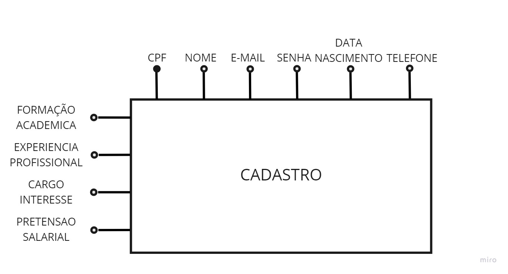
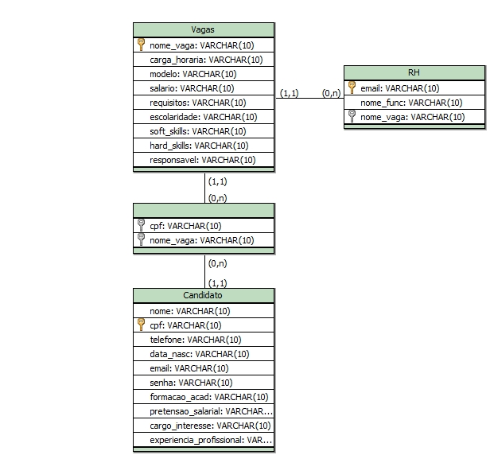
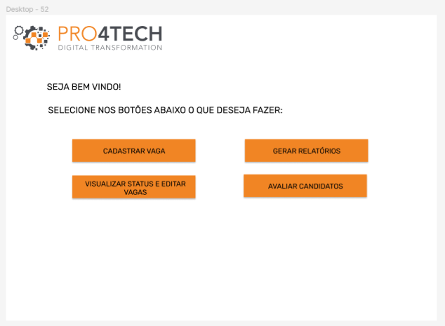

### Dom Rock
2° Semestre - 02/2022

Parceiro Acadêmico: Pro4Tech
<p align="center"></img>

## Empresa parceira

A Pro4tech é uma empresa que visa a transformação digital como um de seus pilares. Seu produto está voltado para criação de soluções digitais, ágeis e inovadoras por meio do desenvolvimento de pessoas. A empresa possui seu portifólio de serviços voltados para soluções em Aplicações Transacionais (Web/App), Aplicações Analíticas (BI/Analytics), Redesenho de Processos de Negócio, Inteligência Artificial (IA), Robotização de Processos (RPA) e Internet das Coisas (IoT).


## 💻 Nossa proposta

A Pro4tech está abrindo varias vagas para contratação de novos funcionários, com isso sentiu a necessidade de ter um software onde pudesse registrar e ter todo o controle das vagas que estão ofertando no mercado.

### Solução para o problema
A solução apresentada por nós e a criação de um sistema desktop que possuia a finalidade de receber cadastrados nas vagas, disponibilizar vagas, excluir e editar as vagas também geração de relatórios.

## Modelagem do Banco

<p align="center"></img>
<p align="center"></img>

## Contribuições Individuais
<details>
 <summary><b>Tela de opções do RH</b></summary>
  <br>
<p align="center"></img>
  <p>A tela é utilizada para mostrar as opções para o RH</p>
  

```java
package ClassesConexao;

import java.awt.Color;
import java.awt.EventQueue;

import javax.swing.JFrame;
import javax.swing.JPanel;
import javax.swing.border.BevelBorder;
import javax.swing.border.EmptyBorder;
import javax.swing.JLabel;
import javax.swing.ImageIcon;
import java.awt.Font;
import javax.swing.SwingConstants;
import javax.swing.JButton;
import java.awt.event.ActionListener;
import java.awt.event.ActionEvent;

public class TelaMenuRH extends JFrame {

	private JPanel contentPane;

	/**
	 * Launch the application.
	 */
	public static void main(String[] args) {
		EventQueue.invokeLater(new Runnable() {
			public void run() {
				try {
					TelaMenuRH frame = new TelaMenuRH();
					frame.setVisible(true);
				} catch (Exception e) {
					e.printStackTrace();
				}
			}
		});
	}

	/**
	 * Create the frame.
	 */
	public TelaMenuRH() {
		setResizable(false);
		setDefaultCloseOperation(JFrame.EXIT_ON_CLOSE);
		setBounds(100, 100, 1920, 1080);
		contentPane = new JPanel();
		contentPane.setBackground(Color.WHITE);
		contentPane.setBorder(new EmptyBorder(5, 5, 5, 5));
		setContentPane(contentPane);
		contentPane.setLayout(null);
		
		JLabel LOGO = new JLabel("");
		LOGO.setIcon(new ImageIcon("C:\\Users\\TI ADCe\\Documents\\Tobias\\Dev\\Projeto\\Pro4Tech\\icons\\iconPro4Tech.jpg"));
		LOGO.setBounds(28, 31, 555, 105);
		contentPane.add(LOGO);
		
		JLabel TEXT1 = new JLabel("SEJA BEM VINDO!");
		TEXT1.setHorizontalAlignment(SwingConstants.LEFT);
		TEXT1.setFont(new Font("Arial", Font.BOLD, 18));
		TEXT1.setBounds(126, 169, 470, 65);
		contentPane.add(TEXT1);
		
		JLabel TEXT2 = new JLabel("SELECIONE NOS BOTÕES ABAIXO O QUE DESEJA FAZER:");
		TEXT2.setFont(new Font("Arial", Font.BOLD, 18));
		TEXT2.setBounds(125, 200, 577, 76);
		contentPane.add(TEXT2);
		
		JButton AvaliarCandidatos = new JButton("AVALIAR CANDIDATOS");
		AvaliarCandidatos.addActionListener(new ActionListener() {
			public void actionPerformed(ActionEvent e) {
				TelaVagasCandidato exibir = new TelaVagasCandidato();
				exibir.setVisible(true);
				setVisible(false);
			}
		});
		AvaliarCandidatos.setForeground(Color.BLACK);
		AvaliarCandidatos.setFont(new Font("Arial", Font.BOLD, 16));
		AvaliarCandidatos.setBorderPainted(false);
		AvaliarCandidatos.setBorder(new BevelBorder(BevelBorder.RAISED, null, null, null, null));
		AvaliarCandidatos.setBackground(new Color(241, 133, 36));
		AvaliarCandidatos.setAutoscrolls(true);
		AvaliarCandidatos.setBounds(825, 503, 245, 65);
		contentPane.add(AvaliarCandidatos);
		
		JButton CadastrarVagas_1 = new JButton("CADASTRAR VAGAS");
		CadastrarVagas_1.addActionListener(new ActionListener() {
			public void actionPerformed(ActionEvent e) {
				TelaCadastroVagas exibir = new TelaCadastroVagas();
				exibir.setVisible(true);
				setVisible(false);
			}
		});
		CadastrarVagas_1.setForeground(Color.BLACK);
		CadastrarVagas_1.setFont(new Font("Arial", Font.BOLD, 16));
		CadastrarVagas_1.setBorderPainted(false);
		CadastrarVagas_1.setBorder(new BevelBorder(BevelBorder.RAISED, null, null, null, null));
		CadastrarVagas_1.setBackground(new Color(241, 133, 36));
		CadastrarVagas_1.setAutoscrolls(true);
		CadastrarVagas_1.setBounds(427, 363, 245, 65);
		contentPane.add(CadastrarVagas_1);
		
		JButton GerarRelatorios_1 = new JButton("GERAR RELATÓRIOS");
		GerarRelatorios_1.addActionListener(new ActionListener() {
			public void actionPerformed(ActionEvent e) {
				TelaGraficoRH exibir = new TelaGraficoRH();
				exibir.setVisible(true);
				setVisible(false);
			}
		});
		GerarRelatorios_1.setForeground(Color.BLACK);
		GerarRelatorios_1.setFont(new Font("Arial", Font.BOLD, 16));
		GerarRelatorios_1.setBorderPainted(false);
		GerarRelatorios_1.setBorder(new BevelBorder(BevelBorder.RAISED, null, null, null, null));
		GerarRelatorios_1.setBackground(new Color(241, 133, 36));
		GerarRelatorios_1.setAutoscrolls(true);
		GerarRelatorios_1.setBounds(825, 363, 245, 65);
		contentPane.add(GerarRelatorios_1);
		
		JButton EditarVagas_1 = new JButton("EDITAR VAGAS");
		EditarVagas_1.addActionListener(new ActionListener() {
			public void actionPerformed(ActionEvent e) {
				TelaEdicao exibir = new TelaEdicao();
				exibir.setVisible(true);
				setVisible(false);
			}
		});
		EditarVagas_1.setForeground(Color.BLACK);
		EditarVagas_1.setFont(new Font("Arial", Font.BOLD, 16));
		EditarVagas_1.setBorderPainted(false);
		EditarVagas_1.setBorder(new BevelBorder(BevelBorder.RAISED, null, null, null, null));
		EditarVagas_1.setBackground(new Color(241, 133, 36));
		EditarVagas_1.setAutoscrolls(true);
		EditarVagas_1.setBounds(427, 503, 245, 65);
		contentPane.add(EditarVagas_1);
		
		JLabel lblNewLabel_1 = new JLabel("");
		lblNewLabel_1.setIcon(new ImageIcon("C:\\Users\\Ariane Sousa\\Desktop\\PROJETOS\\Pro4Tech\\icons\\iconPro4Tech.jpg"));
		lblNewLabel_1.setBounds(0, 0, 517, 100);
		contentPane.add(lblNewLabel_1);
		
		JButton EditarVagas_1_1 = new JButton("SAIR");
		EditarVagas_1_1.addActionListener(new ActionListener() {
			public void actionPerformed(ActionEvent e) {
				TelaLogin exibir = new TelaLogin();
				exibir.setVisible(true);
				setVisible(false);
			}
		});
		EditarVagas_1_1.setForeground(Color.BLACK);
		EditarVagas_1_1.setFont(new Font("Arial", Font.BOLD, 16));
		EditarVagas_1_1.setBorderPainted(false);
		EditarVagas_1_1.setBorder(new BevelBorder(BevelBorder.RAISED, null, null, null, null));
		EditarVagas_1_1.setBackground(new Color(241, 133, 36));
		EditarVagas_1_1.setAutoscrolls(true);
		EditarVagas_1_1.setBounds(10, 781, 102, 54);
		contentPane.add(EditarVagas_1_1);
		
		JButton EditarVagas_1_2 = new JButton("CADASTRAR USUARIOS PRO4TECH");
		EditarVagas_1_2.addActionListener(new ActionListener() {
			public void actionPerformed(ActionEvent e) {
				TelaCadastroRH exibir = new TelaCadastroRH();
				exibir.setVisible(true);
				setVisible(false);
			}
		});
		EditarVagas_1_2.setForeground(Color.BLACK);
		EditarVagas_1_2.setFont(new Font("Arial", Font.BOLD, 16));
		EditarVagas_1_2.setBorderPainted(false);
		EditarVagas_1_2.setBorder(new BevelBorder(BevelBorder.RAISED, null, null, null, null));
		EditarVagas_1_2.setBackground(new Color(241, 133, 36));
		EditarVagas_1_2.setAutoscrolls(true);
		EditarVagas_1_2.setBounds(415, 646, 655, 65);
		contentPane.add(EditarVagas_1_2);
		setLocationRelativeTo(null);
		setExtendedState(MAXIMIZED_BOTH);
	}
}
```
<p>A classe 'TelaMenuRH' é utilizada para realizar o direcionamento do usuario para outras telas. Cada botão direciona para uma tela diferente e há botões de retornar para essa tela principal em todas as telas</p>
</details>


## Tecnologias Utilizadas
Java: Linguagem de programação utilizada para o desenvolvimento do sistema.

Java Swing: Biblioteca gráfica utilizada para criar a interface de usuário.

JDBC (Java Database Connectivity): API do Java para conexão e interação com bancos de dados relacionais.

MySQL: Sistema de gerenciamento de banco de dados relacional utilizado para armazenar informações sobre usuários e autenticação.


## Lições Aprendidas

<p align="justify"></p>

<h3>Hard Skills</h3>
<details>
  <summary><b>Clique para ver a lista de hard skills</b></summary>
<p1>Desenvolvimento da estrutura da tela: Aprendi a realizar a criação da interface gráfica da tela principal utilizando o java Swing. Realizei a ligação das classes pelos botões utilizando o Java.</p1>

<p1>Conexão com Banco de Dados: Aprendi a realizar a criação das tabelas e das ligações para melhor desempenho do sistema e também a realizar as classes de pesquisa.</p1>

</details>
<h3>Soft Skills</h3>
<details>
  <summary><b>Clique para ver a lista de soft skills</b></summary>
<p1>Resolução de Problemas: Foi necessario realizar a criação do código com cautela pois seram varias pessoas alterando o código e também utilizavamos um banco de dados</p1>

<p1>Comunicação: Foi necessario a comunicação clara com a equipe para termos a visibilidade de entrega e também para não haver conflito de entrega<p1>

</details>


## Meus Projetos
## Semestres

- [Semestre 1](../Semestre01/Semestre01.md)
- [Semestre 3](../Semestre03/Semestre03.md)
- [Semestre 4](../Semestre04/Semestre04.md)
- [Semestre 5](../Semestre06/Semestre05.md)
- [Semestre 6](../Semestre05/Semestre06.md)