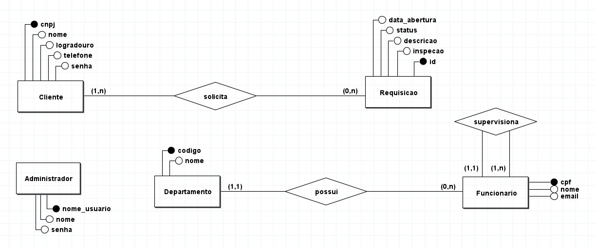
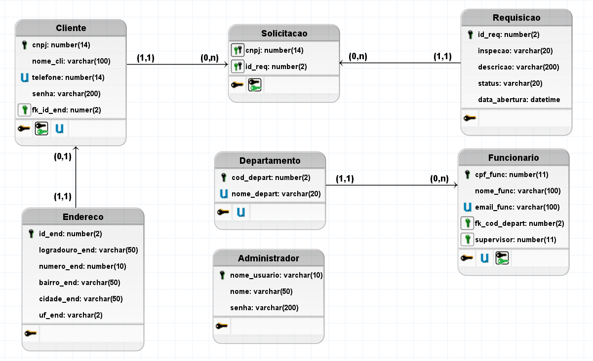

### Jaia
4° Semestre - 02/2023

Parceiro Acadêmico: Jaia

## 💻 Nossa proposta

Jaia Software Em um cenário onde a paisagem urbana se compõe de uma mistura de edifícios modernos e históricos, a empresa Jaia, apresentou um desafio significativo. A condução de inspeções prediais estava provando ser uma tarefa morosa e suscetível a imprecisões. Diante desse cenário, a Jaia buscou soluções inovadoras para otimizar esse processo crucial. A visão estratégica da empresa contemplou o desenvolvimento de um software de inspeção predial, projetado para revolucionar a abordagem atual. A plataforma concebida promete oferecer uma experiência intuitiva, capacitando os inspetores a documentar minuciosamente detalhes relevantes e capturar evidências visuais de forma eficaz. Adicionalmente, a geração instantânea de relatórios abastecerá a tomada de decisões embasadas. A Jaia, reconhecendo a necessidade de aprimorar a qualidade e eficiência das inspeções, direcionou seus esforços para o desenvolvimento desse software inovador. O resultado obtido transcendeu as expectativas iniciais, beneficiando não somente a empresa, mas também elevando o padrão das inspeções prediais na esfera urbana, contribuindo, assim, para uma maior segurança e excelência nas estruturas urbanas.

## Modelagem do Banco

### <p align="center">DER</p>
<p align="center"></img>

### <p align="center">Mer</p>
<p align="center"></img>

## Contribuições Individuais
<details>
<summary><b>Modelagem: Realização da modelagem de dados</b></summary>
<br>
<p>Realizei a modelagem e a criação das tabelas, com base na necessidade do cliente e depois auxiliei para fazer a integração do banco ao back-end.</p>
  


</details>

<details>
<summary><b>AuthController: Controle de Autenticação</b></summary>
<br>
<p>O código acima implementa o controlador de autenticação (AuthController), responsável por lidar com as solicitações de autenticação dos usuários. Aqui está uma explicação detalhada do que acontece no código:</p>

```java
import org.springframework.beans.factory.annotation.Autowired;
import org.springframework.http.HttpStatus;
import org.springframework.http.ResponseEntity;
import org.springframework.web.bind.annotation.CrossOrigin;
import org.springframework.web.bind.annotation.PostMapping;
import org.springframework.web.bind.annotation.RequestBody;
import org.springframework.web.bind.annotation.RequestMapping;
import org.springframework.web.bind.annotation.RestController;

import com.dataTeam.jaia.jaia.model.AuthRequest;
import com.dataTeam.jaia.jaia.service.AuthService;

@RestController
@CrossOrigin
@RequestMapping("/api/auth")
public class AuthController {

    private final AuthService authService;

    @Autowired
    public AuthController(AuthService authService) {
        this.authService = authService;
    }

    @PostMapping("/login")
    public ResponseEntity<String> login(@RequestBody AuthRequest authRequest) {
        String username = authRequest.getUsername();
        String password = authRequest.getPassword();
        String tipoDocumento = authRequest.getTipoDocumento();

        if ("cnpj".equals(tipoDocumento)) {
            String result = authService.authenticateCliente(username, password);
            return ResponseEntity.ok(result);
        } else if ("cpf".equals(tipoDocumento)) {
            String result = authService.authenticateFuncionario(username, password);
            return ResponseEntity.ok(result);
        }

        return ResponseEntity.status(HttpStatus.BAD_REQUEST).body("Tipo de documento inválido");
    }
}
```
<p>O AuthController recebe solicitações POST na rota `/api/auth/login`, onde um objeto `AuthRequest` contendo o nome de usuário, senha e tipo de documento é enviado no corpo da solicitação. Dependendo do tipo de documento (cnpj ou cpf), o método `login()` chama o serviço de autenticação apropriado (`authenticateCliente` ou `authenticateFuncionario`). Se o tipo de documento não for válido, uma resposta de status 400 é retornada.</p>
</details>


## Tecnologias Utilizadas
Spring Boot: Framework utilizado para desenvolver o Back-End do software.

Vue.js: Framework JavaScript utilizado para construir a interface interativa da página.

Oracle SQL: Sistema de gerenciamento de banco de dados relacional utilizado para armazenar informações sobre usuários e autenticação.

Figma: utilizado para o desenvolvimento e prototipação das wireframes.

## Lições Aprendidas

<p align="justify"></p>

<h3>Hard Skills</h3>
<details>
  <p1>Desenvolvimento Web: Aprofundei meu conhecimento em HTML, CSS e JavaScript, implementando uma landing page responsiva e intuitiva para promover o serviço de inspeção predial.</p1>
  <p1>Oracle Sql: Aprendi a fazer as conexões oracle com um datacenter</p1>
  <p1>Spring Boot: Utilizei o Spring Boot para implementar a lógica de autenticação do sistema, facilitando o desenvolvimento e garantindo a segurança das informações dos usuários.</p1>
</details>
<details>
  <h3>Soft Skills</h3>
  <p1>Trabalho em Equipe: Colaborei com membros da equipe para definir requisitos, prioridades e prazos, demonstrando habilidades de comunicação e cooperação.</p1>
  <p1>Resolução de Problemas: Enfrentei desafios técnicos durante o desenvolvimento do sistema, buscando soluções eficientes e adaptáveis para garantir a qualidade do produto final.</p1>
  <p1>Gerenciamento de Tempo: Aprendi a gerenciar meu tempo de forma eficaz, equilibrando as demandas do projeto com outras responsabilidades e compromissos pessoais.</p1>
</details>

## Meus Projetos
## Semestres

- [Semestre 1](../Semestre01/Semestre01.md)
- [Semestre 2](../Semestre02/Semestre02.md)
- [Semestre 3](../Semestre03/Semestre03.md)
- [Semestre 5](../Semestre06/Semestre05.md)
- [Semestre 6](../Semestre05/Semestre06.md)