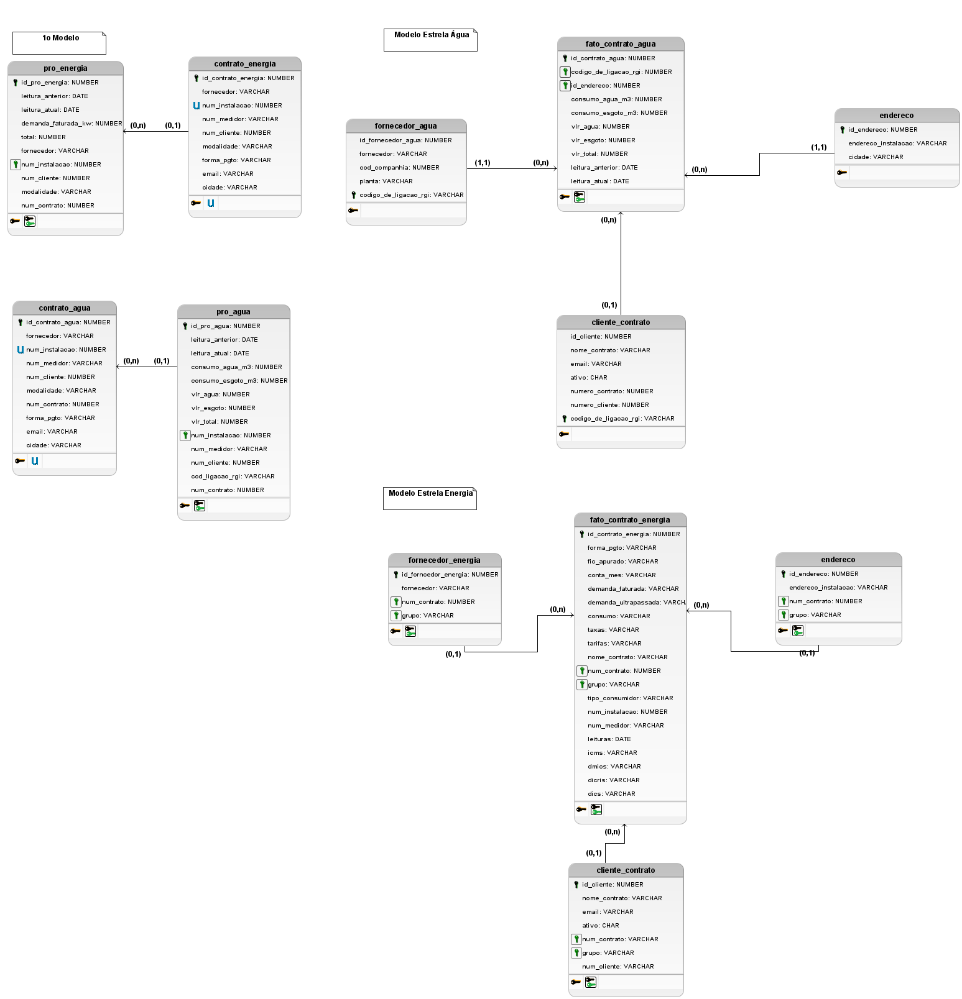

### Dom Rock
5° Semestre - 01/2024

Parceiro Acadêmico: Tecsus

## Empresa parceira

A Tecsus é uma startup que desenvolve dispositivos, aplicativos e sistemas para a transmissão e recepção de dados, controle de equipamentos remotos e gestão de faturas. Aplicados nos setores de abastecimento de água, distribuição de eletricidade e gás natural.

## 💻 Nossa proposta

A Tecsus realiza a coleta e processamento de contas de energia, água e gás para diversas empresas dos setores do atacado e varejo. Cada conta coletada precisa ter todos os seus campos digitados e salvos em banco de dados para eventuais consultas e análises técnicas/financeiras que podem trazer ao cliente oportunidades de redução de custos e alteração de contratos. Cada unidade do cliente pode possuir vários contratos (água, energia ou gás), cada contrato pode possuir uma ou mais contas (faturas de água, energia ou gás) por mês. Todos esses contratos estão ligados a uma concessionária de abastecimento. A Tecsus possuem uma base de dados de unidades, contratos, contas e concessionárias desestruturada em arquivo texto, a empresa tem interesse em aplicar técnicas de ETL e utilizar ferramentas de visualização de dados do mercado.

### Solução para o problema
Com isso sugerimos a criação de um sistema aonde possuí o acesso a todos esses dados facilmente e é possível inserir esses dados, juntamente com a criação de Dashboards pelos dados inseridos.

## Modelagem do Banco

### 
DER

</img>

## Contribuições Individuais

 
<b>Modelagem do Banco</b>

   

</img>
  
A modelagem foi utilizada por todo projeto para montar a estrutura do sistema

  

Foi necessario realizar a criação da modelagem seguindo o modelo estrela. Visto a proporção das planilhas e dados foi realizado um estudo encima dos dados para realizar o melhor relacionamento

## Tecnologias Utilizadas

- Python
- JavaScript
- Vue
- HTML
- CSS
- Oracle SQL

## Lições Aprendidas

<h3>Hard Skills</h3>

  
<b>Clique para ver a lista de hard skills</b>

<p1>Desenvolvimento do modelo estrela: Aprendi a realizar a analise e compreender as relações necessarias para o modelo estrela</p1>

<p1>Deploy: Aprendi a realizar a criação do arquivo '.yml' o qual é utilizado para realizar a configuração do Deploy, aprendi também a configurar a maquina utilizada.</p1>

<h3>Soft Skills</h3>

  
<b>Clique para ver a lista de soft skills</b>

<p1>Organização: Foi necessario organizar as tarefas e entregas pois tinhamos que coordenar as entregas do DevOps para gerar um fluxo.</p1>

<p1>Comunicação: Foi necessaria a comunicação para conseguir compreender melhor as tabelas encaminhadas para nós e também para organização das entregas.<p1>

## Meus Projetos
## Semestres

- [Semestre 1](../Semestre01/Semestre01.md)
- [Semestre 1](../Semestre01/Semestre02.md)
- [Semestre 3](../Semestre03/Semestre03.md)
- [Semestre 4](../Semestre04/Semestre04.md)
- [Semestre 6](../Semestre05/Semestre06.md)
